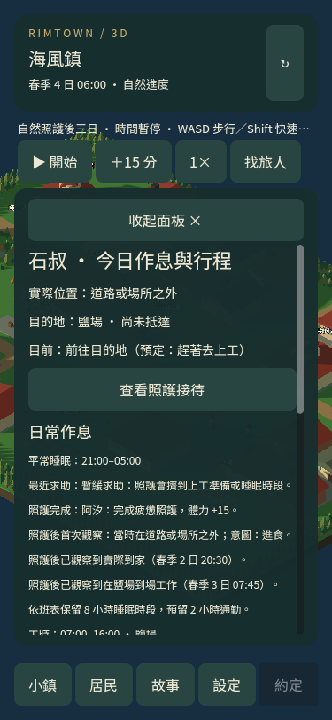
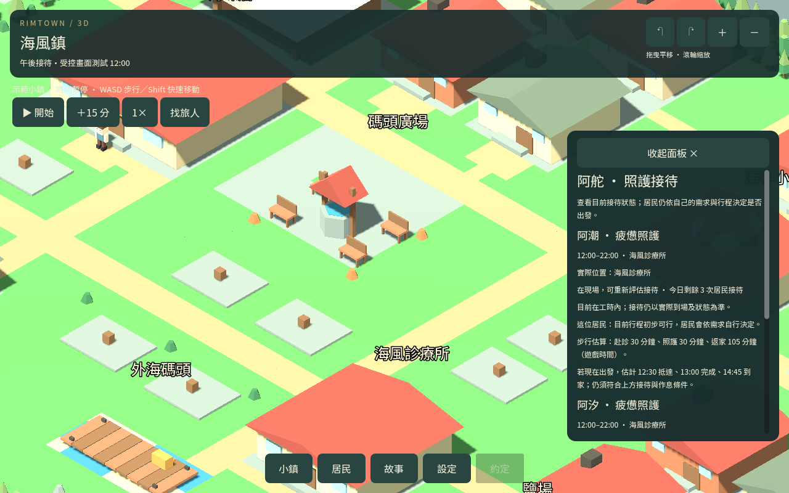
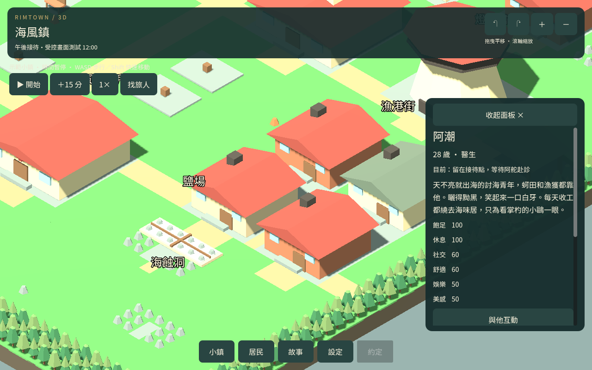
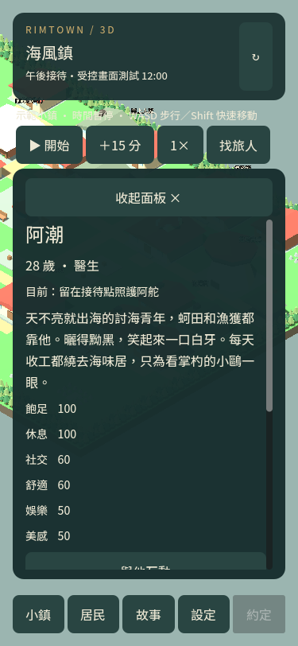

# 照護後生活追蹤

2026-09-13

新的居民照護完成紀錄會接著觀察最多一個遊戲日：照護後首次觀察時的位置與意圖、實際到家，以及實際到工作點上工。可以在居民的行程紀錄查看；日期與時間使用遊戲時鐘。

「準備走回家」不是「已到家」。到家必須確認人在自己的住處、已停步並完成進門；上工必須確認在有效工作時間、實際工作場所與步行終點，已停步且處於工作狀態。路上、門口、已改變目的地或只站在工作場所附近都不算到場工作。

這項追蹤只記錄原有行程，不發出新目的地、不加速、不延長照護、不發放資源或第二次照護效果。一般工作、飲食、睡眠、守衛輪班與每日照護額度繼續沿用原規則。沒有工作的居民觀察到家後即可結束；有工作的居民保留到家與上工兩項證據，最晚在固定期限後結束。

進度會保存已觀察到的證據與原截止時間。已完成、已到期或居民狀態不再適用的追蹤不重啟；缺少位置時不猜測，舊照護紀錄和中止紀錄不補寫後續。紀錄仍受既有最近八筆照護結果上限約束。

## 驗證

64 項專項涵蓋兩鎮、醫護／牧師的真實受控到場照護、正常步行到工作點與住處、意圖與到場區分、同刻重複呼叫、進行中／完成後讀檔、固定期限、缺少位置及舊紀錄不回填。測試中的工作安排與需求有明確控制，不視為自然樣本。

12 組回歸通過。海風鎮從容模式三日自然模擬共 276,480 個移動影格、69,120 個姿勢樣本，兩次中途讀檔，所有 15 位原有居民觀察到正常步行與實際到家睡眠；未出現異常步距、接地、守衛值勤或接待額度錯誤。

石叔在第二天第 146 刻完成醫護照護，體力 +15；20:30 觀察到在住家停步，第三天 07:45 觀察到在鹽場工作，追蹤於原期限前完成。照護後首次觀察的位置在路上、意圖為進食，沒有把該意圖寫成已到家或已用餐。這是自然模擬的實際結果，不代表所有居民一定能在一天內完成返家與上工。

新交付三日進度已壓縮並通過完整性檢查、實際選檔匯入、位置／追蹤保存、不重發效果與手機行程文字共 8 項。解壓縮後匯入 progress/照護後三日_harbor.rimtown，選「居民 → 石叔 → 行程」查看；匯入時是第四天 06:00，頁面同時保留先前確認到場的日期，不會把今日通勤誤寫成今日已上工。

原生桌面／手機四圖完成，補齊前包的等待、照護與午後班表，並以本包自然進度擷取後續里程碑。修正擷取脚本的型別、縮排及受控示範顯示舊職稱的問題；實際畫面逐張查看。

