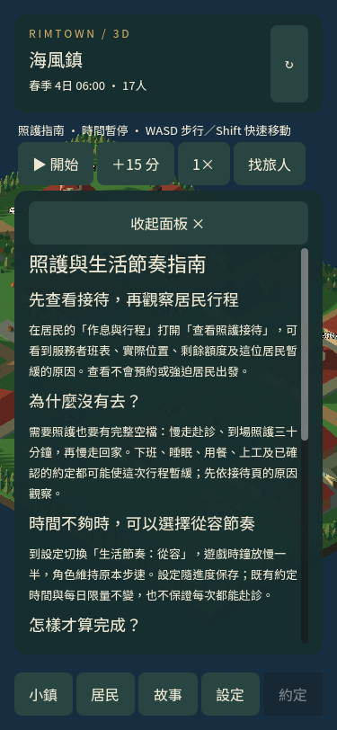
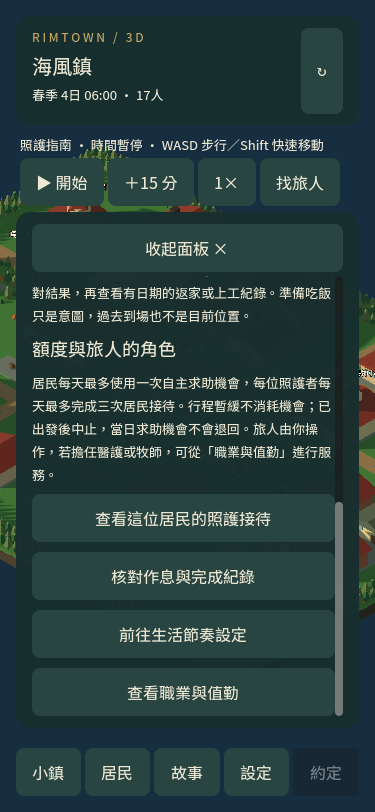

# 照護系統操作導引

遊戲內新增「照護與生活節奏指南」，入口位於設定頁，以及居民照護接待頁的「看懂照護與赴診」。指南說明需求、實際位置、工時、完整往返與原約定如何影響赴診，並區分暫緩、已出發中止及實際完成。

從居民頁開啟時，可直接返回該居民接待頁或核對作息與完成紀錄；另提供生活節奏設定、職業與值勤入口。閱讀沒有預約、移動、資源或額度副作用，也不自動切換節奏。世界更新時保留指南與捲動位置。

## 如何試玩

1. 匯入包內的 `progress/照護後三日_harbor.rimtown`，選石叔，打開作息與行程。
2. 核對完成照護後的第二日 20:30 到家、第三日 07:45 到鹽場上工紀錄。這是歷史證據，並非目前位置。
3. 打開照護接待，再選「看懂照護與赴診」。接待頁顯示此刻實際條件；指南說明各種暫緩的意義。
4. 若希望時鐘慢一些，從指南前往設定，手動選擇從容節奏。角色保持原有步速，舊約定時間與每日額度仍保留；不保證每次都能赴診。
5. 若旅人擔任醫護或牧師，從職業與值勤查看自己的服務操作。指南不會自動轉職。

原有節奏的長途接待仍受工時與睡眠空檔限制。前包原有節奏兩鎮各兩日均未自然完成照護；本包沒有調整這些條件，也沒有把讀取既有完成紀錄當成新的自然完成。

驗證：7 組整合檢查合計 291 項通過。指南專項 20 項涵蓋 375×812／1280×800、真實按鈕導覽、世界更新不換頁、閱讀無副作用、自然歷史紀錄及手動節奏切換。其餘回歸涵蓋往返約定、路線估算、自然進度匯入、照護搭話、節奏保存及接待。

原生畫面已驗證桌面／手機各上、下兩張，捲動及四個導覽按鈕完整可見，無橫向溢出。

