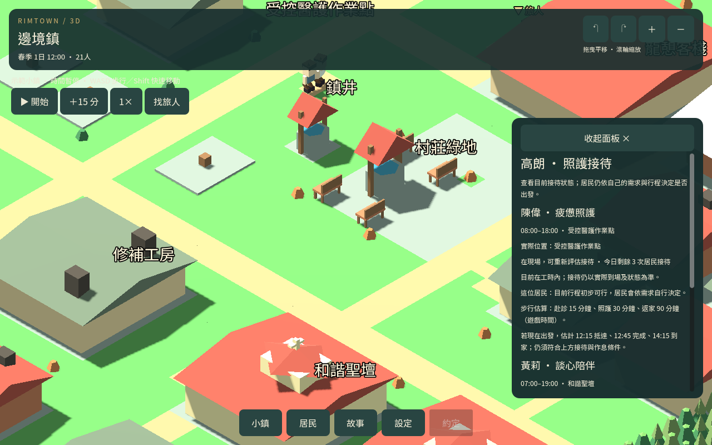
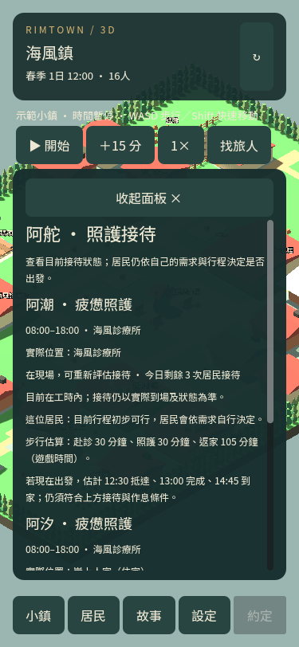

# 照護往返時間

2026-09-13

## 玩家看到的資訊

在居民行程的「查看照護接待」中，服務者已實際到場且有可通行路線時，顯示赴診、三十分鐘照護、返家的分段時間，以及假設現在出發的抵達、完成和到家時間。跨午夜標明明天。

這是正常步行及既有觀察餘裕的估算，不是已出發或預約成功。上方的需求、接待、每日機會和作息限制仍適用。服務者正在走動、位置未知或路線無法確認時，不捏造固定接待點時間。

## 路程修正

照護去程已使用實際接待點，但先前返程還從建築中心計算。本包讓照護的可行性、準備後接待判斷與畫面估算共用實際接待點至出口、住家入口和自己的房間。其他邀約／休閒原有呼叫仍使用原本起點。

未改移動速度、接待工時、三十分鐘照護、需求恢復值、每日限量或既有存檔期限。

## 驗證

60 項專項涵蓋兩鎮兩種照護職業，包含完整門口路線、實際正常步行返家在估計時間內到達、原有呼叫相容、只讀取不安排、手機文字、讀檔重建及跨午夜。相關回歸與四日自然觀察分開記錄。

11 組回歸通過，包含準備限制、接待只讀取、照護、候補、返家及約定後續。舊四日交付進度匯入 22 項通過；交付存檔沿用既有進度。

## 四日自然觀察

海風鎮原班表、需求與資源下，仍有 27 次居民—醫護—遊戲刻觀察在基本條件通過後趕不上完成前下班，沒有自然照護完成。去程估計 90–150 分鐘、照護 30 分鐘、返程 75–150 分鐘。

首例阿福在第 139 刻 16:45：去程 150 分鐘，預估 19:15 到診所、19:45 完成、22:15 到家。這是以當下位置與固定行程算出的假設，居民並未真的走這趟。

這也說明不能只看延後接待工時：返家仍可能很晚。下一包應比較地圖距離與遊戲時鐘比例，保留畫面上的正常慢走與每日限量，確認通勤、邀約和睡眠的整體影響後再採用。

完整分段觀察見 CARE_ITINERARY_AUDIT.json；計數是重複時間觀察，不是 27 位不同居民。
