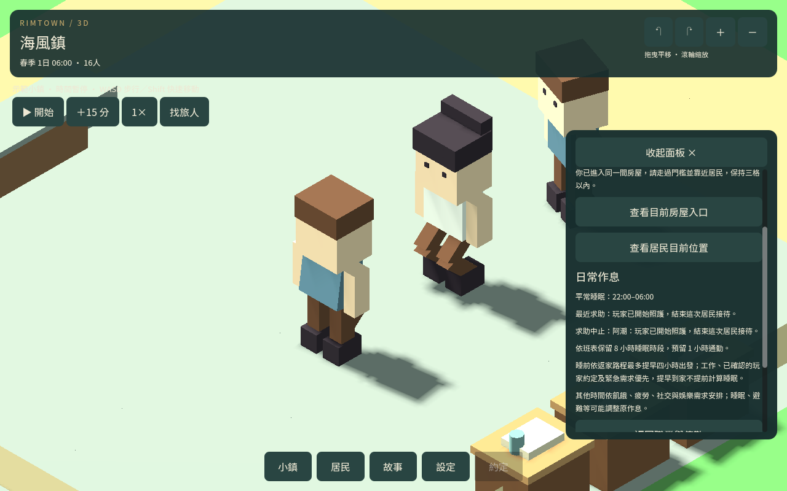

# 照護與行程整合

2026-09-12。本包完成玩家介入、跨日、職業變更與四日自然作息驗證，並修正接待衝突。

## 修正

玩家開始照護一位正在服務別人的醫護／牧師，或接手其接待對象時，原本 NPC 接待立即中止，解除停留與關懷姿勢。中止不消耗 NPC 完成額度、不發效果；玩家自己的工作仍能繼續並依原有規則完成。也排除正在接受玩家服務或已有優先見面行程的 NPC 服務者。

換日先處理舊玩家值勤預約，再判斷 NPC 接待資格，避免上一日狀態影響新日。改職、場所移除、午夜、必要行程與讀回中止存檔都不會讓舊照護重新生效。

## 驗證

32 組回歸共 99,388 項檢查通過。新增十二組兩鎮控制情境（72 項）使用真正玩家開始／完成值勤接口，驗證玩家接手接待兩端、服務者與對象換職、場所移除、換日與取消後讀檔。

兩鎮各 384 刻（四日）、184,320 個移動影格，中途讀檔；合計 25 項自然檢查通過。原始工作、日夜守衛、步行返家及睡眠未見回歸；無超量 NPC 接待或誤發效果。

邊境鎮沒有自然求助；港鎮四位居民留下六次求助中止，三位曾在逐刻快照中維持求助狀態，另一位同刻遇到必要行程而取消。沒有自然完成照護，不能把控制情境成功當作自然照護平衡完成。結果鍵已統一整數刻數，避免 JSON 讀檔後數字格式差異重複計數。

四組原生控制情境確認玩家接手後立即中止，結果頁顯示原因。測試有控制需求、接待點及玩家近身位置；邊境診所為測試工作點，不代表開局已有設施。

## 下載與後續

Godot 4.7.1 匯入 godot/project.godot 後執行主場景。原生重現場景為 tests/care_lifecycle_visual_scene.tscn。progress 沿用先前兩份四日存檔並另檢查相容性；本次自然運行資料在 CARE_LIFECYCLE_NATURAL_*.json，不將沿用存檔冒稱本次成果。

本機曾發現長者模型匯入快取損壞，已重新匯入並在乾淨專案重跑；含載入錯誤的早期運行不列入通過結果。

下一包改善求助前的路程、可用空檔及中止原因，減少白跑；不以加快移動、跳過睡眠或降低到場條件換取成功率。自然完成率與長期效果平衡仍未結案。
