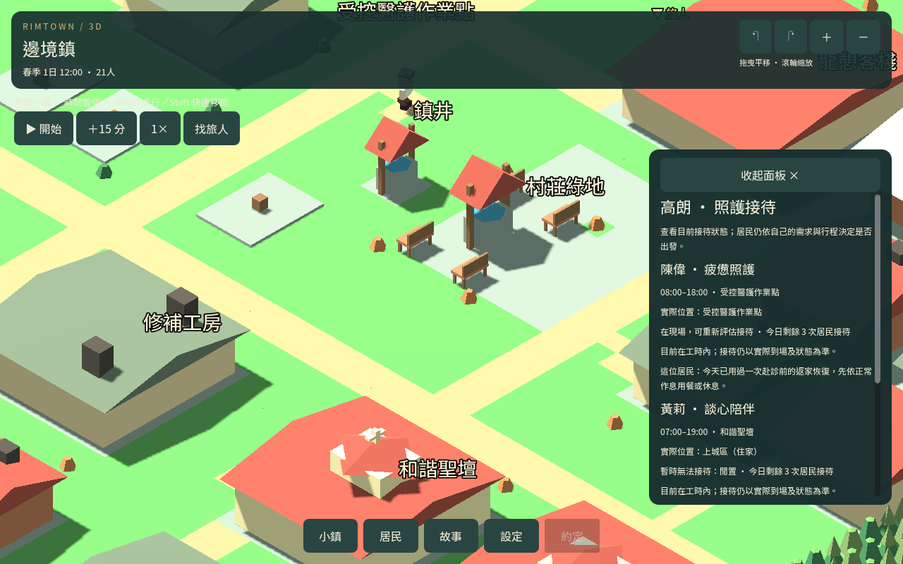
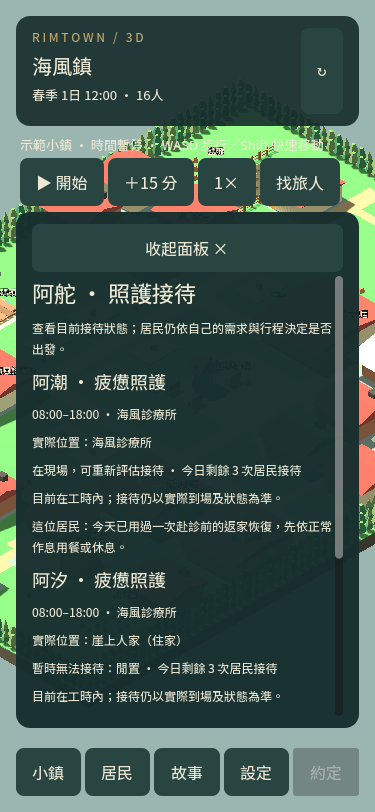

# 赴診準備一致性

2026-09-13

接待頁原先核對了返家準備後的接待空檔，卻未核對開始準備本身的全部限制。因此居民已用過當日恢復，或不足以安全返家時，頁面仍可能顯示需要先回家準備，實際模擬則不啟動。

本包抽出不改變狀態的準備計畫檢查，供畫面與實際安排共用。區分當日已用過、步行觀察缺失、無返家路線、超過四小時、返家飲食／體力不足、工作／睡眠及既有約定衝突。畫面只讀取；實際接受時使用同一份期限和恢復目標。

拒絕會更新最近求助說明，已有暫緩紀錄也使用同一原因。不消耗恢復或赴診機會、不增加需求值；成功安排保留原每日一次、正常慢走、到家才恢復及固定期限。昨天的使用記錄不阻擋今天，既有安排讀檔不延長。

## 驗證

104 項專項涵蓋兩鎮醫護／牧師、顯示與實際拒絕一致、預覽不改狀態、接受時目標／期限一致、當日與昨日界線、實際讀檔與到家用餐，以及不同失敗原因。

相關回歸使用原有接待、恢復、紀錄、讀檔、日常循環與交付測試。本包不修改醫護／守衛工時、產出或照護限量。自然時段統計單獨列示，不能將「可行」或「可準備」當作已完成服務。

10 組回歸通過，含本包 104 項、原接待頁 84 項、日常循環 537 項及舊四日交付進度匯入 22 項。桌面與手機原生提示已檢查；圖片為受控「當日已用過恢復」情境。

## 自然時段觀察

海風鎮四日、每刻 480 個移動影格，保留原職業、需求、資源與班表。觀察本身的狀態不變檢查通過。以下為「居民—服務者—遊戲刻」觀察次數，不是不同居民人數：

- 醫護：4,260 次沒有疲憊照護需求；1,275 次有需求但居民有優先安排；127 次有需求但服務者尚不能接待；27 次雙方通過基本條件後，仍趕不上完成前下班。
- 上述 27 次中，2 次在 16 點、25 次在 17 點。首例為第 139 刻 16:45 的阿福，飲食 38.4、體力 31.6。
- 牧師：5,689 次皆沒有談心需求。
- 沒有自然照護完成，也沒有直接行程可行或可進一步準備的觀察。

下一包聚焦 16–17 點下工窗口，分開量測抵達、半小時接待與返家餘裕，再比較接待策略；不能把上述重複觀察視為 27 位求助者。完整報告見 CARE_TIMING_AUDIT.json。
