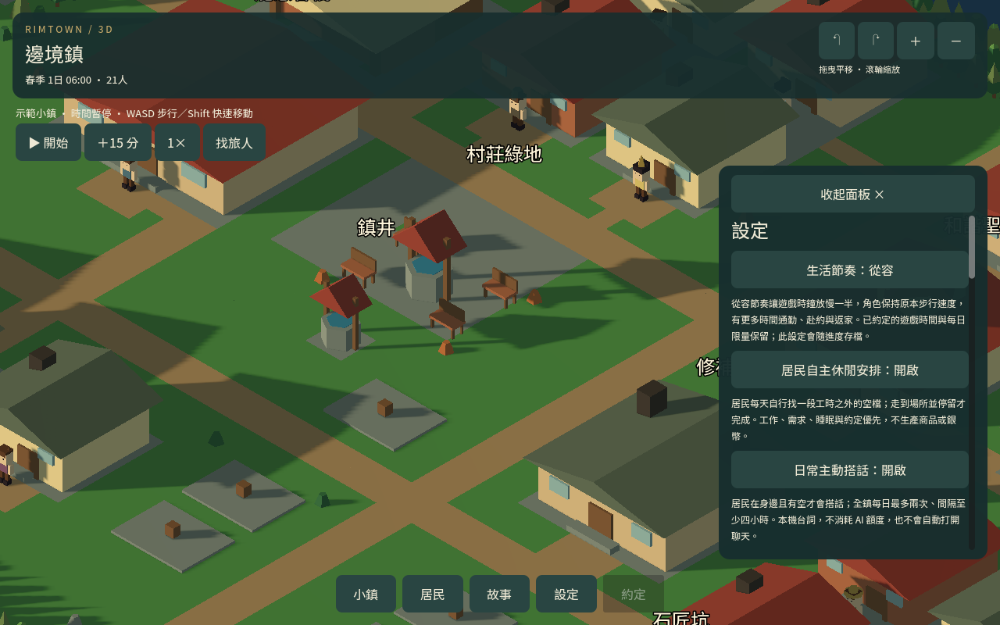
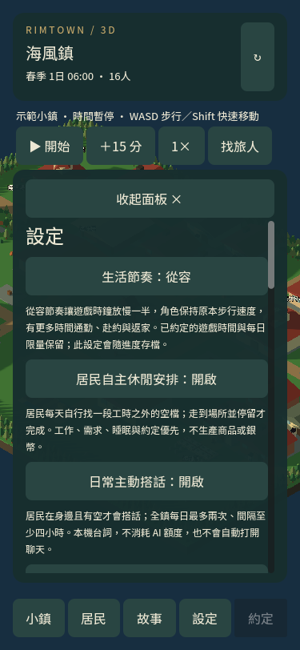

# 可選生活節奏

2026-09-13

## 使用

設定 → 點「生活節奏：原有」切換為「從容」，再點一次可切回。

- 原有：每 8 秒推進 15 分鐘遊戲時間。
- 從容：每 16 秒推進 15 分鐘遊戲時間。

以上以 1 倍速計算。從容模式下完整遊戲日約 25 分 36 秒，原有約 12 分 48 秒；暫停與播放倍速另計。角色每個畫面步驟的移動不變，因此同樣一個遊戲小時有更多正常步行時間。通勤、返家和照護路程估算使用所選比例。

兩種模式都保留原有工時、每日產量與接待限額。切換不補發資源、不推進遊戲時間、不移動角色，會按比例保留未滿一刻的時間進度，並重新估算通勤需要的睡眠安排，保留原睡眠長度。已約定的遊戲時間及已開始行程的期限不延長；改回較快時鐘後，既有行程仍可能趕不上，需按原規則重新處理。

新示範鎮與舊存檔預設仍是原有模式；新進度保存明確模式。讀檔保留已選模式、位置與刻內進度，無效模式回到原有設定。

## 驗證

36 項專項涵蓋兩鎮切換、逐影格移動一致、時鐘閾值、資源／需求／職業／守衛與約定不變、睡眠長度、存檔與舊格式、無效設定，以及手機按鈕。兩種節奏都實際通過遊戲更新入口的時間邊界檢查。

本包將從容節奏作為可選模式，不以自然照護完成數作為已解決整體接待平衡的宣稱。

10 組相關回歸通過，包含原節奏下的日常循環、接待、準備、守衛輪班、睡眠與約定。交付舊四日進度匯入 22 項通過，交付進度沿用既有存檔；需在設定自行切換從容模式。

兩鎮各兩日原始需求自然模擬通過（邊境鎮 14 項、海風鎮 11 項），共檢查 368,640 個移動影格，中途實際讀檔。20／15 位原有居民皆觀察到步行與到家睡眠；未發現異常移動、接地、值勤或限額錯誤。兩鎮都沒有自然照護完成，海風鎮仍有趕不上服務者下班的暫緩；時鐘選項並未解決整體接待時段。此測試沒有產出新的兩日交付存檔。
