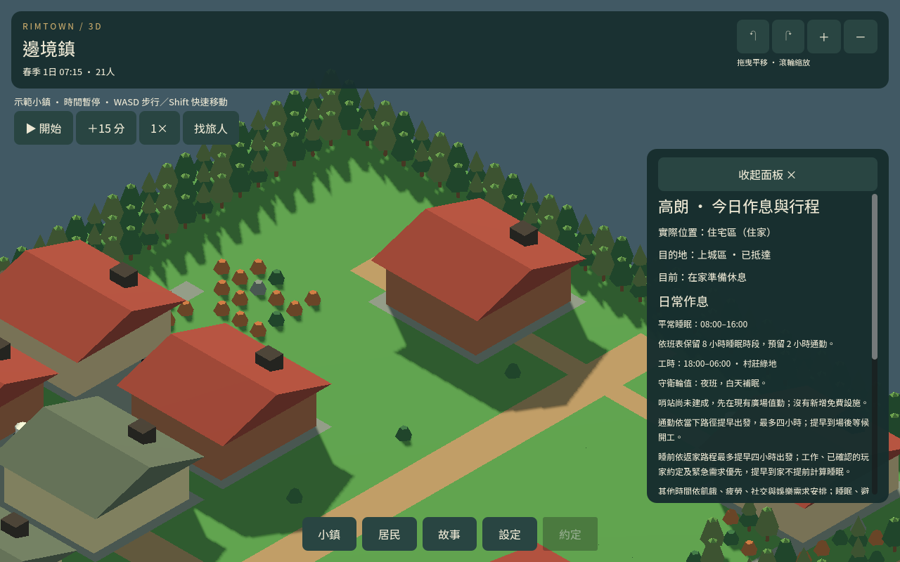
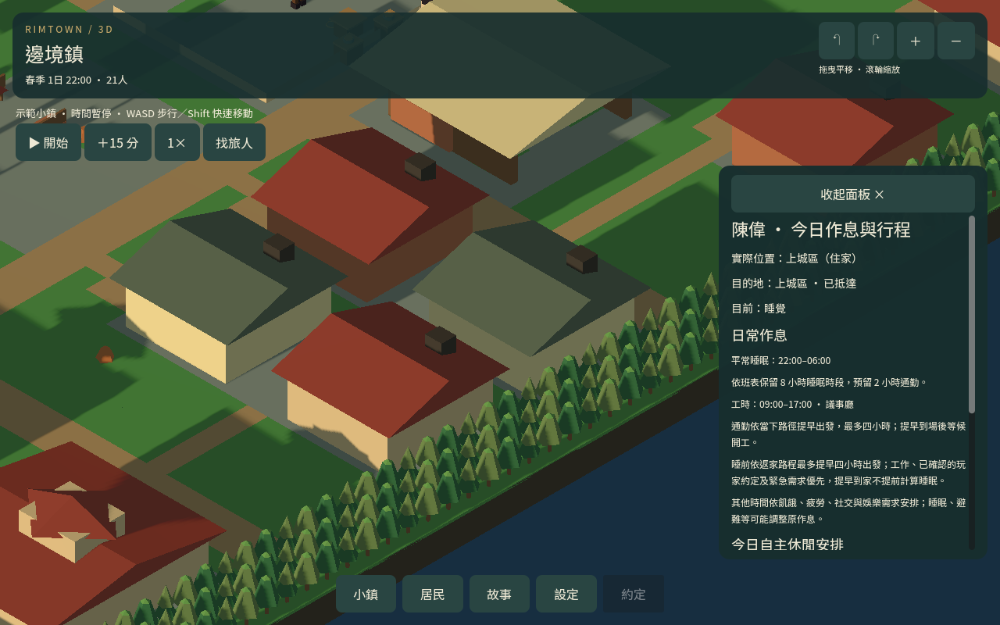

# 日常循環整合

2026-09-13

## 行為修正

- 居民沿原路步行返家，實際進入自己的房間並停步後，改為「在家準備休息」。門口與行走途中仍是返家。
- 長路程居民提早到家，保留原返家安排直到就寢；原本就在家的居民於睡前最後一小時準備休息。正常睡眠依每人的班表開始，夜班守衛仍在白天補眠。
- 準備休息不提前發放睡眠恢復。已啟動且安全的短暫用餐／休息可以接續；工作、通勤、已確認約定和正式睡眠仍保有原優先順序。
- 已停在自己家中的返家距離為零，避免恢復安排誤算成「走出門再回來」。未變更移動速度、產出、錢包或照護限量。

## 驗證範圍

原有兩鎮 35 位居民的控制測試涵蓋實際遊戲刻、移動、讀檔、睡前停留、正式入睡、醒來解鎖，以及夜班守衛；另測安全恢復與玩家約定優先。控制測試會設定起始位置與需求，不能視為自然生活結果。

原生場景拍攝陳偉、高朗與海風鎮阿舵的準備休息／入睡，共六張圖片。長時間自然模擬保留原居民需求、資源、職業與班表，中途實際讀檔；它是日常循環回歸，不代表所有玩法或自然照護平衡已完成。

交付包的兩份四日進度沿用既有存檔，本包另外驗證匯入相容性；七日測試報告不冒充新交付存檔。

## 本次結果

- 睡前與恢復專項 537 項、舊進度匯入 22 項通過。
- 邊境鎮／海風鎮各七日，共 645,120 個移動影格；所有原有居民實際步行並在自己家睡眠，中途讀檔保留位置，沒有偵測到越班值勤、穿地或超過步長上限。
- 自然觀察到邊境鎮 20 人、海風鎮 14 人（含移入者）準備休息；這不是每位居民必定每天提前在家的承諾。
- 海風鎮留下 11 筆返家恢復達標紀錄，沒有恢復中止；兩鎮仍沒有自然照護服務完成，不能把自行用餐休息算成赴診成功。

驗證明細見 DAILY_CYCLE_TESTS.json、DAILY_CYCLE_REGRESSION.json、DAILY_CYCLE_NATURAL_FRONTIER.json、DAILY_CYCLE_NATURAL_HARBOR.json、DAILY_CYCLE_DELIVERY.json 與 DAILY_CYCLE_CAPTURE.json。

50 組回歸全部通過。同行八日測試初次受四分鐘測試器上限中止於第六日，獨立重跑後完整通過：五筆邀約、三次真實近距離到場碰面，另一次安排變更取消、一次未出發到期；返家最大單步約 0.941。完整觀察見 DAILY_CYCLE_SHARED_LEISURE.json。
