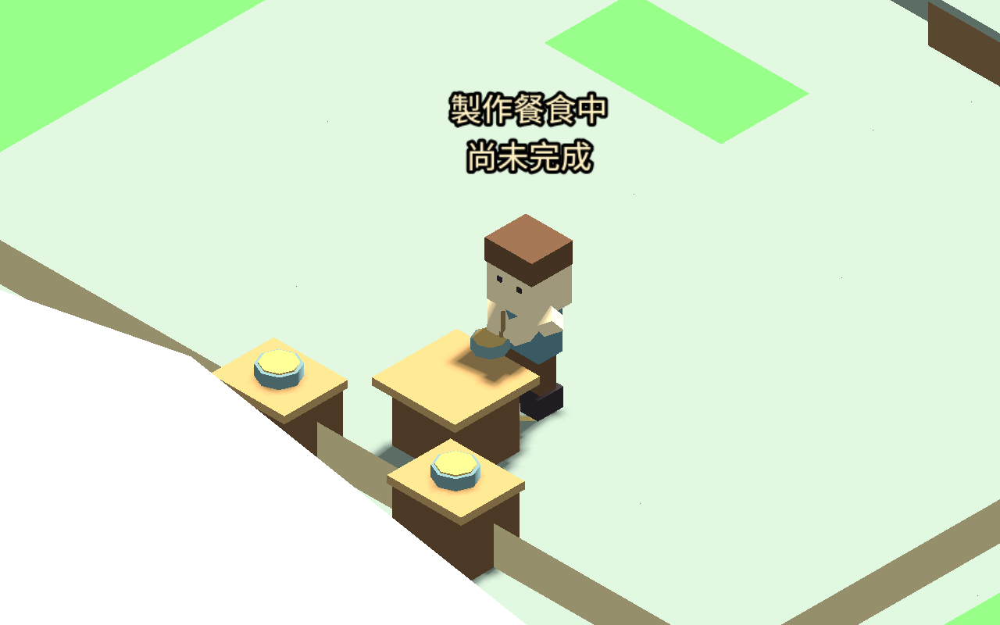
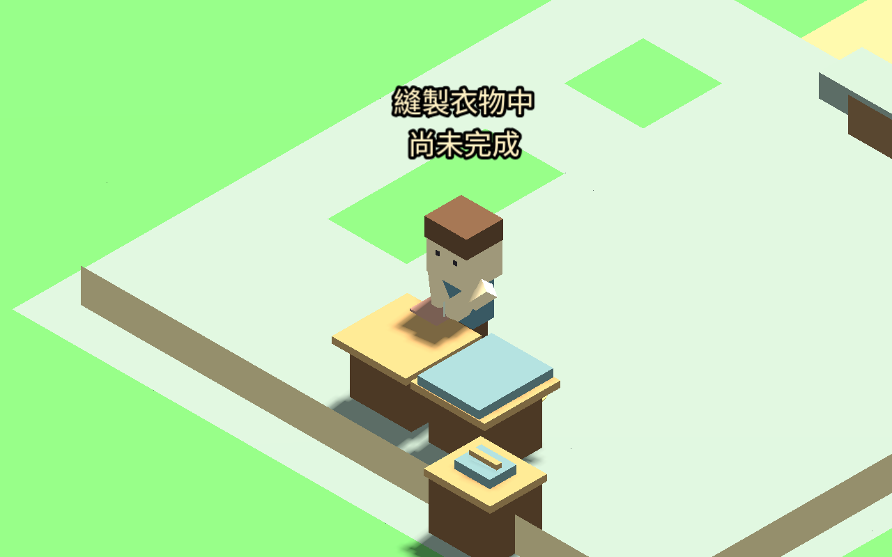
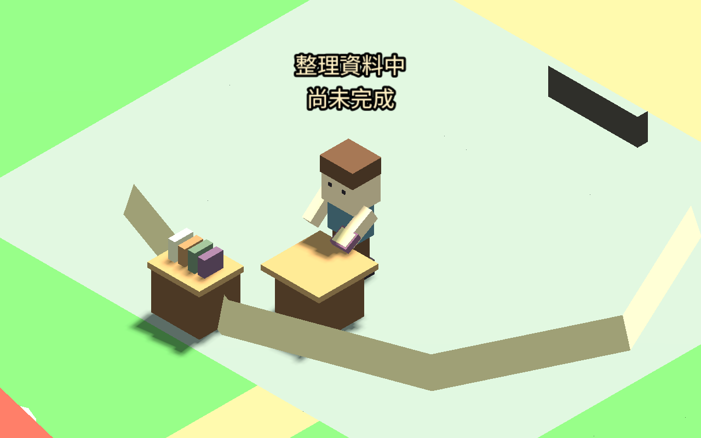

# 料理、裁縫與研究操作台（2026-09-12）

廚師、裁縫與研究員接上實際操作台：職業頁可定位料理台、裁縫台或研究桌，玩家需用方向鍵／WASD 走到圓形標記，才能開始值勤。離開標記即使仍在房間內也會中止，讀檔則從當下位置恢復判斷。

裁縫台使用工房第二個位置，與木匠／鐵匠工作台分開；研究桌位於兩鎮各自的研究建築，海風鎮仍使用燈塔。海風鎮原本沒有工房，因此不新增裁縫設施或免費提供值勤。

## 動作與原規則

料理時左手持碗、右手攪拌；裁縫持布並以針上下操作；研究員在桌前持書閱讀。依物件實際包圍盒調整手臂高度，保持碗、布料和書本高於桌面，並校正湯匙及針的水平位置。這些物件仍持在手上，沒有加入放下物件、翻頁或完整手指骨架。

操作台只放在既有阻擋格，站位仍是可行走格，不新增隱形障礙；鏡頭定位不移動旅人。開始、持續、結算共用原本的工作台距離規則。公共材料核准、需求、產量限制、每日額度與完成扣料均沿用原系統，動畫不給額外資源或經驗。

## 驗證

- 新增 7,484 個斷言通過：兩鎮五個可用職業／場所組合，實際走入與到台、拒絕遠端開始、定位不瞬移、完成／離台／取消／原地重載／門口中止；逐幀檢查手持物高於桌面，以及湯匙在碗內、針在布料範圍上方。
- 九組既有回歸共 9,940 個斷言通過，包含工房敲打、家具邊界、室內服務、職業介面與各職業動作。總計 17,424，包含大量幾何取樣，不能當成同數量的獨立玩法案例。
- 原生五個場景均完成走到操作台、值勤、走開中止，共 725 移動幀，保存 15 張動作截圖；五個最終代表畫面均已目視檢查。沒有額外隱藏周遭環境。
- 修正過裁縫持布偏出桌緣及湯匙短暫偏出碗邊，重新執行動作與回歸。測試使用受控需求，未重新執行多日自然職涯模擬。

[新增測試](DESK_STATIONS_TESTS.json) · [回歸](DESK_STATIONS_REGRESSION.json) · [原生紀錄](DESK_STATIONS_CAPTURE.json)

## 後續工作包

接續五種操作台職業的實際到位體驗與多日職涯整合，檢查日界線、工作需求改變、進出與讀檔。NPC 工作站使用、完整步態與音效仍待後續；官網整體風格評估保持排程。本包只完成玩家的三項操作台擴充。
