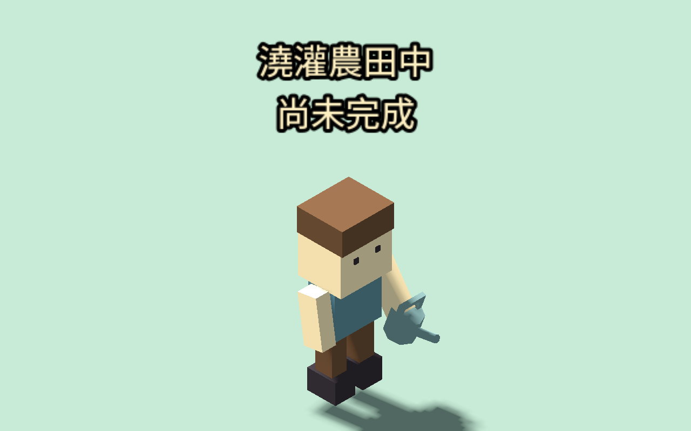
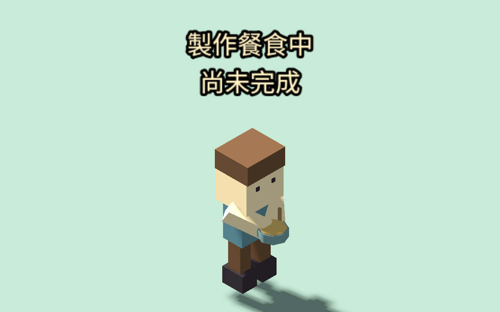
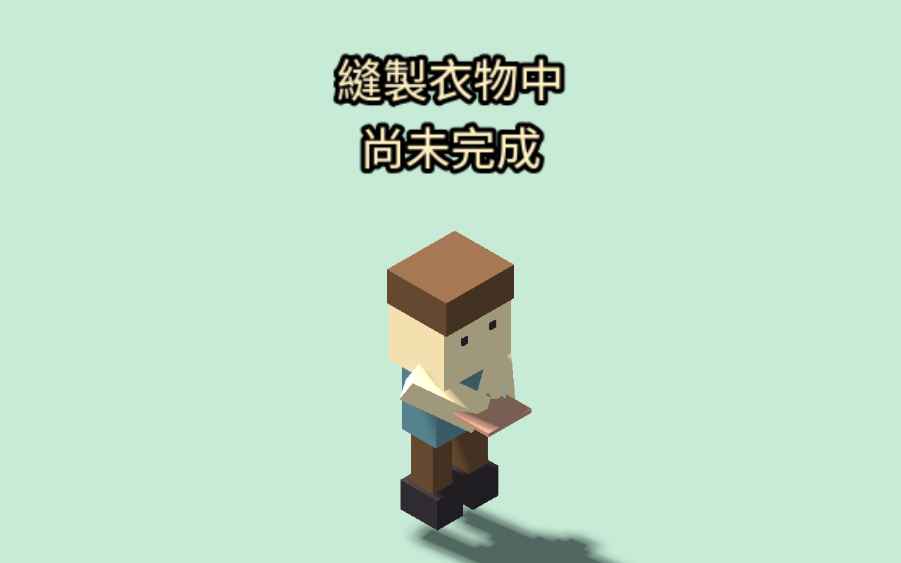
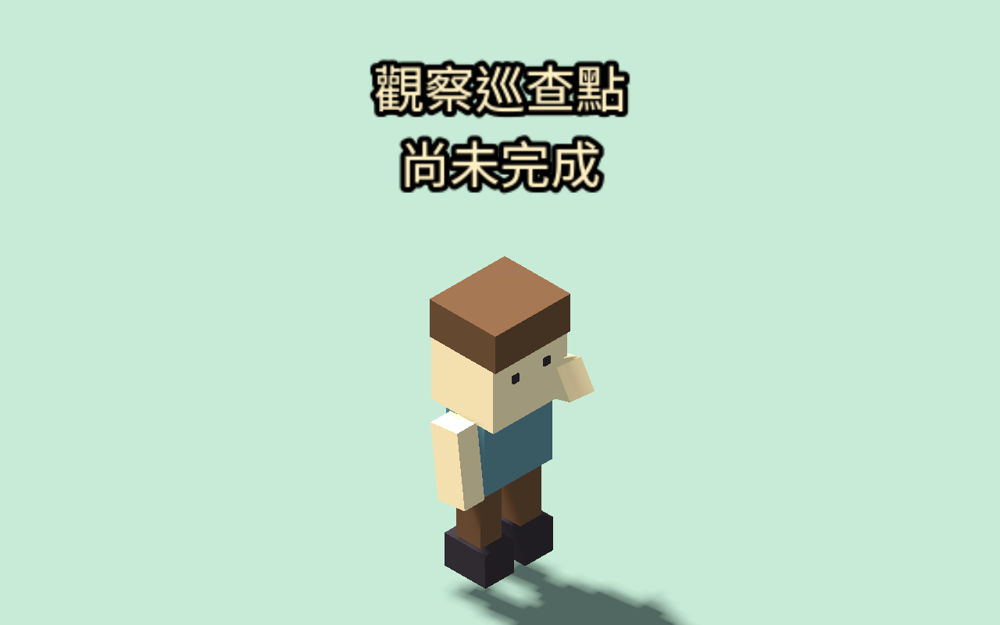
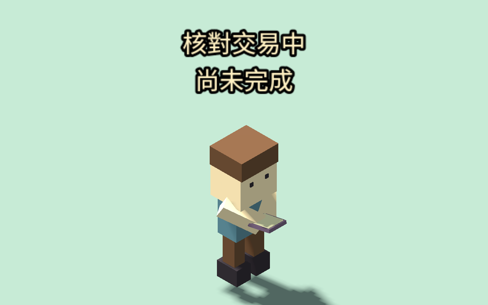

# 五職業日常動作（2026-09-12）

玩家農務、廚師、裁縫、守衛與商人的值勤現在有各自第一版表現：提壺傾倒、持碗攪拌、持布縫製、抬手觀察巡查點、持帳冊核對。道具以簡單低多邊形幾何建立，無外部素材或額外資源支出。鍋碗與布料保持水平，帳冊微傾；雙手距離依操作縮近。

只在已開始、職業相符且玩家在值勤場所時出現。移動立即收起雙手道具；取消／完成清除手勢，提示依真實結算顯示；暫停凍結動作。轉職沿用同一角色時會隱藏舊職業雙手道具，讀檔依 active 工作重建，不恢復過往完成提示。

目前十一種玩家值勤都已有第一版顯示／手勢。這不代表全角色動畫完成：NPC 守衛換班與睡眠不受本包修改，沒有強迫小鎮多一位守衛；農田水位、餐食／衣物產出、巡查紀錄與交易只由既有結算處理，仍保留公共核准、備貨和每日上限，沒有個人錢包。

## 驗收

- 新增 530 項：兩鎮五職業，港口鎮無工房時不提供裁縫值勤；受控需求與到場、實際開始／完成、取消、離開、需求變化／商人離開、讀檔、暫停、步行優先、道具持平、同角色從廚師轉守衛再轉農務無殘留；確認顯示不改座標、世界或獎勵。
- 8 組回歸 1,142 項：前六職業動作、農務／守衛核心、公共製作與介面、交易與介面、缺少設施。合計 1,672 項通過。
- Godot 編輯器原生執行 `tests/everyday_visual_scene.tscn`，五張圖逐張目視檢查；修正初版道具隨手臂過度傾斜與雙手間距。`EVERYDAY_VISUAL_CAPTURE.json` 記錄真實開始值勤的結果。
- 為檢查道具，原生場景隱藏建物並放置中性地板；不移動已到場的玩家。這是受控姿勢驗收，不是自然遊玩紀錄，也不表示室內視線已解決。未新增多日自然模擬驗收。

仍待完善：室內遮擋／工作場所可視性、工作台與物件接觸、全身骨架和步態、音效、水流／針線細節，以及手機近距離視角。澆灌目前是提壺傾倒姿勢，沒有水流粒子；縫製與攪拌仍是簡單肩臂動作，不宣稱細緻肘腕動畫完成。接續優先處理室內值勤看不清人物的問題，再完善工作接觸與步態。
