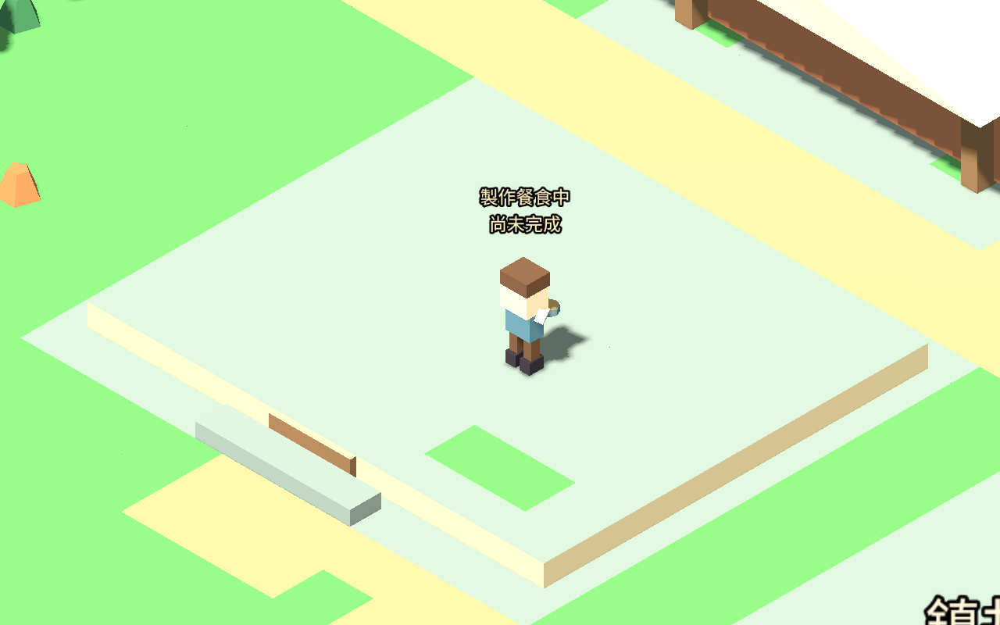
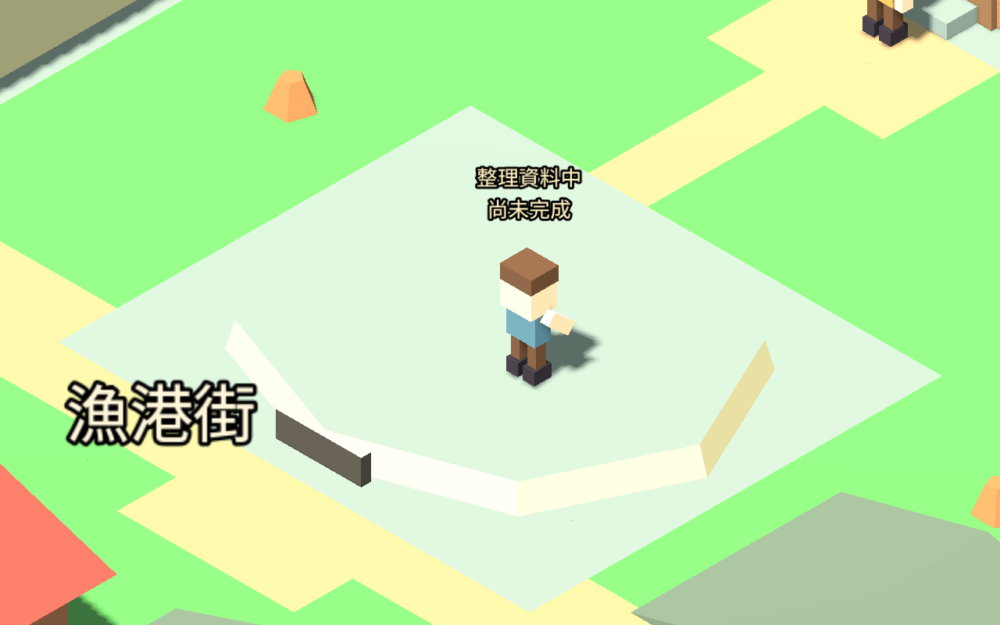
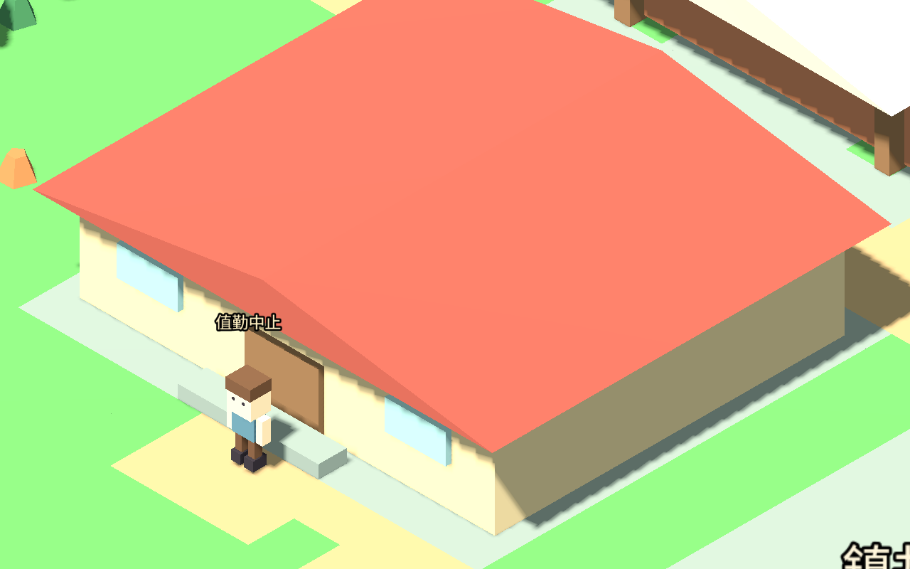

# 室內剖面與工作場所可視性（2026-09-12）

旅人真正走入住宅或有門公共建築後，所在建物切成低牆剖面，讓室內角色與值勤動作可見；走出後恢復屋頂、材質、陰影及地名標籤。門檻或進出門過程不開剖面，只改目的地也不會提前開屋。

## 實作範圍

以實際可行走座標判斷房屋，僅處理旅人所在一棟。著色器裁去世界高度 0.55 以上部分，保留下方建物輪廓；開啟期間取消該殼陰影及自身地名標籤。碰撞、路徑、居民需求、公共庫存、產量、任務結算及存檔資料維持原規則。重載時從位置重建畫面狀態。

## 驗證

- 新增 627 項檢查通過：兩鎮所有已繪製且有門的公共建築及住宅，實際走入／走出、門檻、無玩家、目的地誤導、讀檔、材質及陰影復原。5,159 移動幀，無不可行走格樣本，最大單步約 1.20 像素。
- 六組既有回歸共 1,726 項通過：室內服務、服務動作、四職業持具、五職業日常動作、職業設施及服務停留。合計 2,353 項。
- Godot 原生圖形場景完成兩鎮各餐館、研究場所與住宅，共六例，實際步行進出 682 幀並成功開始工作；產生 18 張入屋前／屋內／離屋恢復圖片。六張室內圖及代表性外觀恢復圖片已目視核對，場景沒有額外隱藏建物。
- 測試需求、初始位置與鏡頭為受控設定；本包未重跑多日自然模擬，不代表完整美術驗收。

資料： [新測試](INTERIOR_CUTAWAY_TESTS.json)、[回歸](INTERIOR_CUTAWAY_REGRESSION.json)、[原生場景](INTERIOR_VISUAL_CAPTURE.json)。

## 後續工作包

接續室內家具／工作台與手持工具的接觸位置；再完善步態、音效及鏡頭遮擋。現有房間仍偏空，鄰近屋頂可能遮住屋外角色，尚未涵蓋所有角度。全站風格評估與官網改版保留在後續排程。
