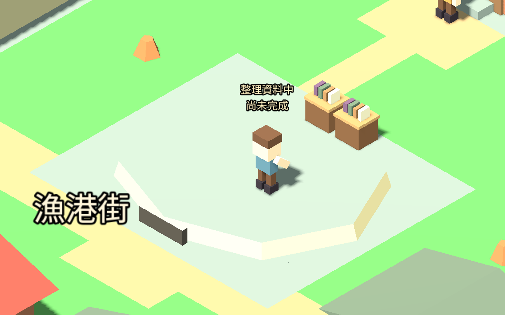

# 室內牆邊擺設（2026-09-12）

所有現有有門建物及住宅新增牆邊矮櫃，餐館放餐具、研究場所／公所放書籍、工房放材料與工具、診所／教堂放布包與瓶罐，住宅等場所放收納用品。只有旅人進入後才隨剖面顯示，離開便隱藏。

擺設只佔既有不可行走的後牆格，離門口至少兩格，每房最多三組；書籍櫃最多兩組，靠中央放置，修正燈塔弧形外殼旁的露出問題。不改尋路、碰撞、存檔、建設費、公共庫存或職業產量。

## 驗證結果

- 新測試 6,485 個斷言通過，多數為每個家具零件的包圍盒八角不佔可行走格檢查，不能等同 6,485 個獨立玩法案例。
- 兩鎮全部現有房屋的真正走入／走出、門檻、顯示隔離、讀檔與世界資料不變通過；5,159 移動幀，無不可行走格樣本。
- 六組既有職業／室內服務回歸 1,726 項通過。總計 8,211 項斷言。
- 原生圖形場景六例（兩鎮餐館、研究場所及住宅）完成進入、開始值勤與離開，共 682 移動幀、18 張圖片。初版六張室內圖目視檢查後調整櫃子位置，燈塔新版再目視確認。需求與位置是受控設定，未重跑多日自然模擬。

[家具檢查](INTERIOR_FURNISHINGS_TESTS.json) · [回歸](INTERIOR_FURNISHINGS_REGRESSION.json) · [原生場景](INTERIOR_FURNISHINGS_CAPTURE.json)

## 未完成的接觸流程

這些是場景擺設，尚未成為必須抵達的工作站。原任務可在房間不同位置開始，仍沿用手持工具／餐碗表現；未宣稱手或工具已與櫃面接觸。下一整包要接工作位置提示、步行抵達、轉身與接觸，再驗證走開／取消／讀檔。床鋪、座椅、完整家具、步態及音效仍待後續；官網整體風格評估保持排程。
