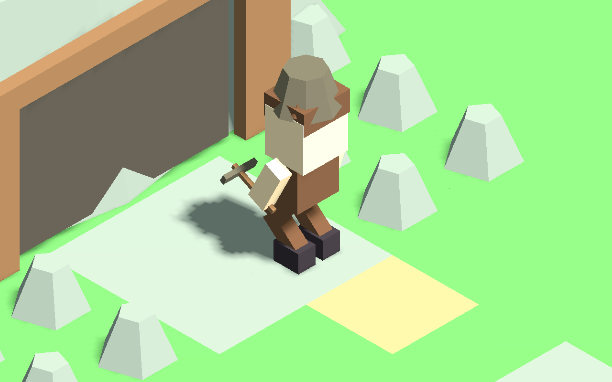
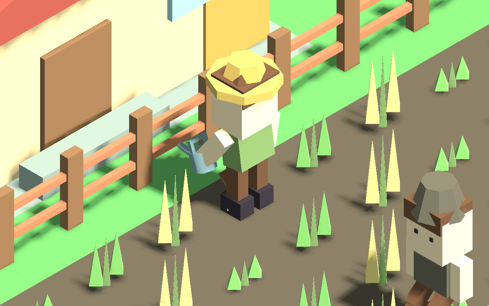
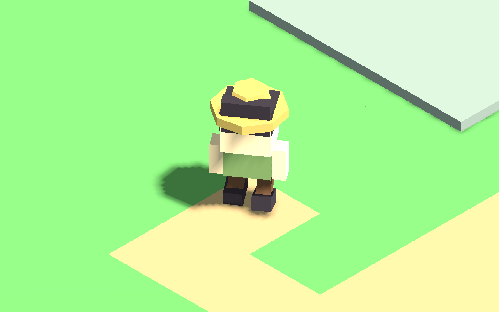

# 居民戶外工作與收工具

居民農夫使用澆水壺，礦工持鎬。只有角色正值工作狀態、實際抵達自己的工作地點及最終步行目的地、站定並完成進出門時，才播放手部動作。走路、返家、睡眠、吃飯、接受服務、赴約／同行／休閒安排或工作場所缺失時，工具收起。受阻或暫停在半途不算到場。

工具掛在手部並依模型身高調整握點與尺寸，取代原來固定掛在身側的鋤頭／鎬。暫停凍結居民工作相位，換職業重新開始相位，讀檔清空工具與相位再依現況判斷，不重播舊工作。

舊農場原來把農舍和田地算在同一區，泛用目的地可能落在農舍附近。本包改為選取原有可通行田畦，依當前工作名單分配不同田畦，保留正常碰撞步行；沒有增加田地。新建灌溉設施沿用完工後產生的原作業點，沒有額外新增設施或戶外工位容量制度。礦場／鹽場建物縮至後方，居民工作目的地移到原有前方石地，避免被模型包在裡面；從建物後方看的相機仍可能遮擋，可使用原有 Q／E 轉向。

顯示動作不推進模擬、不扣或增加物資、不澆灌實際作物、不結算收成。原 NPC 生產與農作系統仍負責產出；玩家的材料核准、備貨及每日值勤上限保持，沒有個人錢包。澆水手勢不代表正在替玩家完成每一塊農田的澆水任務。

## 驗證範圍

- 24 組回歸共 62,081 個檢查通過，含 18 個兩鎮／農地類型／身高情境的 10,645 個到場、握具、離場、碰撞、純顯示、暫停與讀檔檢查。
- 灌溉整合測試透過既有建造 API、原材料成本與工作量完成工程，農夫正常步行到新作業點並開始動作，之後正常返家；此測試控制鎮長身分、材料、需求與時計，不宣稱自然經濟通關。
- 港鎮原有多農夫的獨立田畦與赴約釋放檢查。兩鎮原始新局各跑一日（96 tick、46,080 移動幀），每個移動幀檢查碰撞，動作取樣 15 Hz，含中途重載與在家睡眠；沒有替換原職業或補資源。
- 5 個原生受控情境，15 張工作／離場畫面；角色職業、年齡、農場登記和起步位置為受控資料，後續走路使用正常碰撞。包含年幼模型只是身高適配驗證，不是新增兒童職業排班。
- 舊四日壓縮進度的匯入、原位置、職涯與每日額度、暫存動畫重建檢查；交付包含同一批舊進度，並非本包重新遊玩的四日紀錄。

報告：OUTDOOR_WORK_REGRESSION.json、OUTDOOR_WORK_TESTS.json、OUTDOOR_FARM_INTEGRATION.json、OUTDOOR_FIELD_SHARING.json、OUTDOOR_WORK_NATURAL_FRONTIER.json、OUTDOOR_WORK_NATURAL_HARBOR.json、OUTDOOR_WORK_CAPTURE.json、OUTDOOR_WORK_DELIVERY.json。

這是程序式基本動作，尚未包含礦石接觸／碎裂、灑水粒子、音效、搬運與完整手指骨架。下一包處理守衛巡查、商人盤點表現；既有守衛白班／夜班與小鎮單守衛規則保持。
