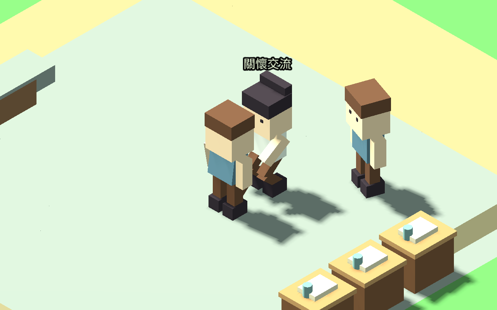
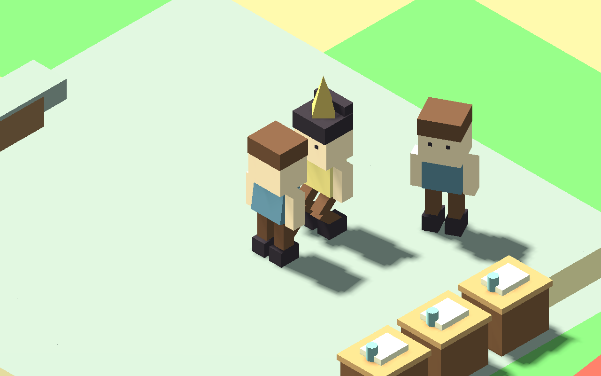

# 居民關懷交談動作

2026-09-12。本包提供醫護與牧師在既有 NPC 交談中的面向與手勢，不建立新的治療、心情恢復、任務獎勵或物資產出。

## 觸發與中止

- 提供者必須實際步行到工作點、站定且在班；本刻有以自己為發起者的真實交談紀錄。
- 雙方實際同處一個場所，距離 12–48 像素，對方站定且有疲憊（休息 10–40）或低落（心情小於 0）需求。
- 對方不能正在上工、睡眠、返家、赴約／同行或接受玩家服務；飢餓、休息等行程優先條件仍適用。
- 一人同時只參與一組。更換對象、下一刻沒有新交談或條件失效，立即收起提示與手勢。
- 暫停時不推進動作；讀檔重建顯示，不延續舊配對。此元件只修改畫面，沒有移動、停留、治療或經濟寫入。

## 驗證

27 組回歸、96,611 項斷言通過；包括兩鎮兩職業、孩童／長者、多人競合、玩家服務優先、對象切換、暫停與讀檔。見 RESIDENT_CARE_REGRESSION.json。

兩鎮各一日使用原始需求、工作與位置自然運行，各 46,080 個移動影格，合計 23 項檢查通過。工作、守衛日夜班、步行返家及睡眠未見回歸。兩個樣本均未出現符合全部條件的關懷配對，因此不將控制情境通過當作自然求診成功。

原生 Godot 四組情境取得 8 張開始／停止截圖。為穩定重現，測試設定職業、需求、接收者位置並呼叫真實交談流程；邊境鎮醫護情境使用測試工作地點，不代表原始城鎮已有診所。

## 試玩與後續

下載包為 Godot 專案，以 Godot 4.7.1 匯入 godot/project.godot 後執行主場景。progress 內附先前驗證的兩份四日存檔，本包另查匯入相容性；並非重新完成四日自然照護測試。重現畫面可執行 tests/resident_care_visual_scene.tscn。

下一包接居民主動求助、實際到場與服務停留，再做需求結算及限量平衡；不得搶走工作、守衛輪班、睡眠或既有約定。本包尚未推出自動診療系統。
