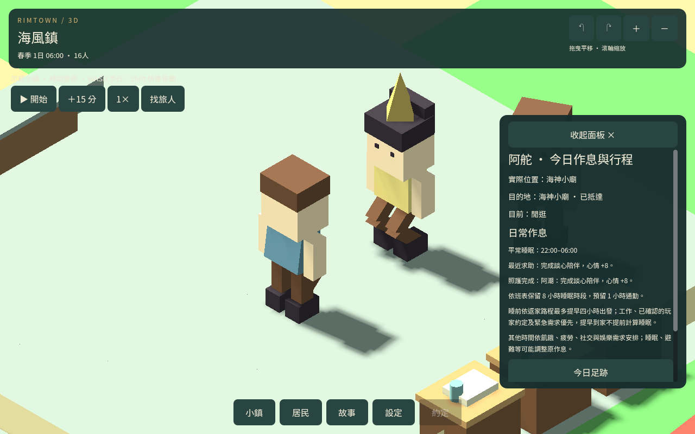

# 限量照護與結果紀錄

2026-09-12。居民主動求助沿用既有步行與短暫停留；確認雙方仍在同室近距離、需求有效、沒有更高優先行程，且停留時間完成後，才結算照護。

醫護恢復 15 點體力；牧師增加 8 點心情支持並保存於既有心情修正值，使下一刻重新計算心情時仍有效。數值遵守原有上限；這是疲憊照護與陪伴，尚非完整疾病診療。

## 限量與防重複

- 玩家與 NPC 共用當日同一居民的同類照護紀錄；已由 NPC 完成者不會再次出現在玩家同類值勤清單，玩家先完成也會阻止 NPC 重複處理。
- 每位 NPC 服務者每日最多完成三次；沿用每位居民每日最多主動求助一次、每位服務者同時接待一人的限制。
- 沒到場、還在交談或中途取消都沒有照護效果，也不消耗完成次數。需求解除或額度已滿時中止。
- 已完成存檔再次載入不重算；即使殘留舊待辦狀態，當日紀錄仍阻止二次結算。讀回更早的完整存檔是回到當時時間線，不宣稱提供伺服器防作弊。
- 不產生物資、金錢、玩家技能或職涯完成獎勵。

## 結果與驗證

行程頁顯示服務者、完成／中止原因與實際效果；每位居民最多保留最近八筆，並在真正完成時記錄照護記憶。到場交談的原本記憶與關係效果仍維持，不當作已完成照護。

31 組回歸通過，含兩鎮兩職業完整求助、途中讀檔、到場、停留與結算。額外以四位不同居民驗證同一服務者完成三次、第四位被阻止，以及隔日重新接待。完成存檔、舊待辦重放、共享玩家紀錄、中止無效果、歷史上限與行程頁均檢查。

兩鎮各一日原始作息、守衛輪班及步行返家未見回歸；樣本沒有符合條件的自然求助，照護效果以控制需求驗證，尚不代表長期自然平衡完成。

四組原生控制情境包含實際步行、交談、結算與結果頁。邊境醫護案例使用測試工作點；不代表原始邊境鎮已建診所。

## 試玩與後續

以 Godot 4.7.1 匯入 godot/project.godot，執行主場景。控制情境可執行 tests/resident_care_outcomes_visual_scene.tscn。下載包沿用兩份先前四日進度並檢查匯入相容性，沒有把舊存檔標成新版四日照護測試。

下一包：服務與日常行程的跨日、職業變更、玩家介入及長時間平衡整合驗收。完整疾病診療、精緻動作及音效仍待完善。
