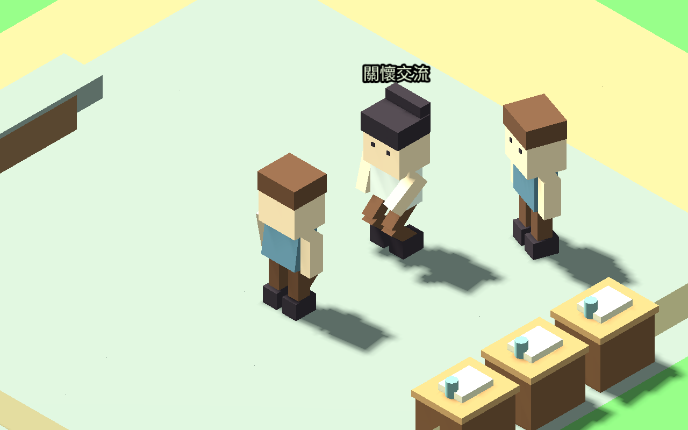

# 居民主動求助、步行與停留

2026-09-12。疲憊或低落的居民在有空檔時，可主動前往醫護或牧師的實際工作場所。沒有設施、在班服務者或有效需求時不建立行程。

## 行為與限制

每位居民每日最多提出一次求助，每位服務者同時接待一人。沿既有碰撞與門口路線行走；在同一場所／房間、近距離站定後才呼叫真實交談流程。停留最多兩刻（遊戲時間三十分鐘），整趟八刻逾時。路線受阻不瞬移，逾時解除。

工作、睡眠、返家、用餐、避難、已安排的見面／休閒與玩家服務優先。服務者離開、換職、場所消失或需求解除時中止；不會為了求助新增守衛或改輪班。讀檔保留實際位置、目的地、每日記錄及期限，不能藉重讀無限重試。行程頁顯示目前求助狀態與最近結果。

本包只完成求助、到場、既有交談及短暫停留；不增加治療數值、物資、職涯獎勵或個人錢包。交談本身仍有原本的關係與記憶效果，不冒稱已治癒。

## 驗證範圍

28 組回歸通過；關懷路線控制測試 2,597 項檢查涵蓋兩鎮兩職業、從廣場實際步行、到場、結束、飢餓、上工、睡眠、玩家服務、避難、停用與逾時。另以實際模擬時鐘驗證兩鎮醫護與牧師全流程，包含途中儲存及重新匯入。

兩鎮各一日自然作息追蹤沒有新增求助，因該樣本未符合全部需求與空檔條件；既有工作、步行返家、睡眠與輪班沒有回歸。不是自然診療成功或長期效果驗證。

四組原生畫面由控制需求、廣場出發與正常路線產生，共 8 張交談／結束截圖。邊境鎮醫護使用測試診所工作點，不代表原始開局已有診所。

## 開啟專案

以 Godot 4.7.1 匯入 godot/project.godot，執行主場景即可繼續遊玩。重現控制情境可執行 tests/resident_care_visits_visual_scene.tscn。progress 內沿用兩鎮先前四日存檔；這些存檔並非本包重新完成的四日求助測試。

下一包接入限量照護效果、結果紀錄與重複結算防護；完整疾病診療、音效與精緻動作仍待完善。
