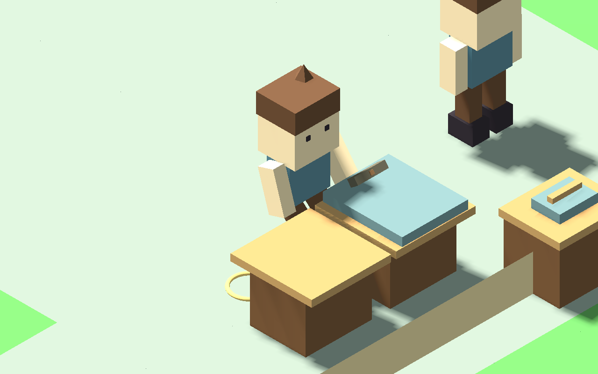
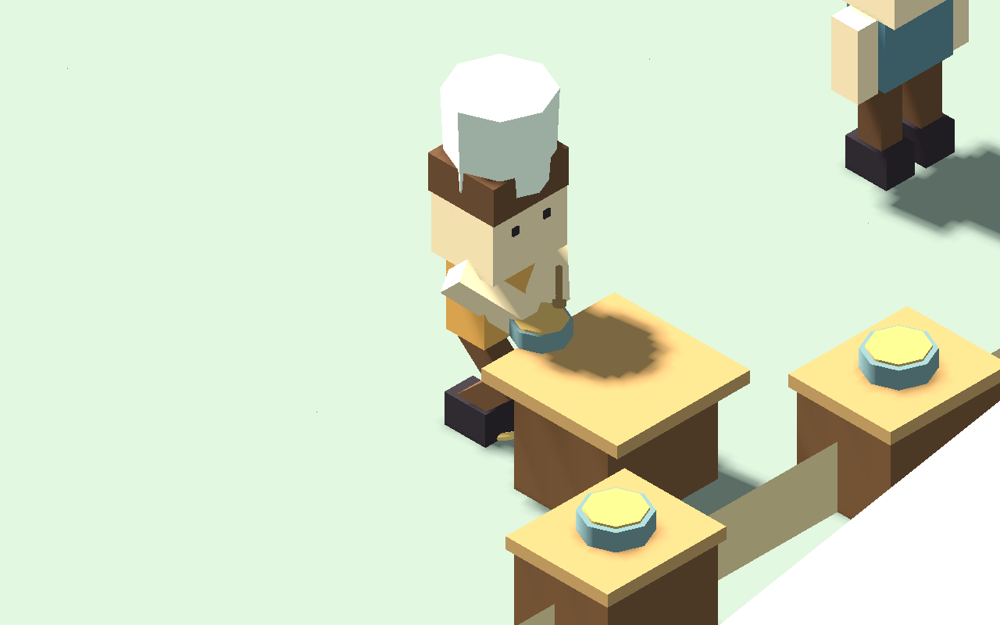
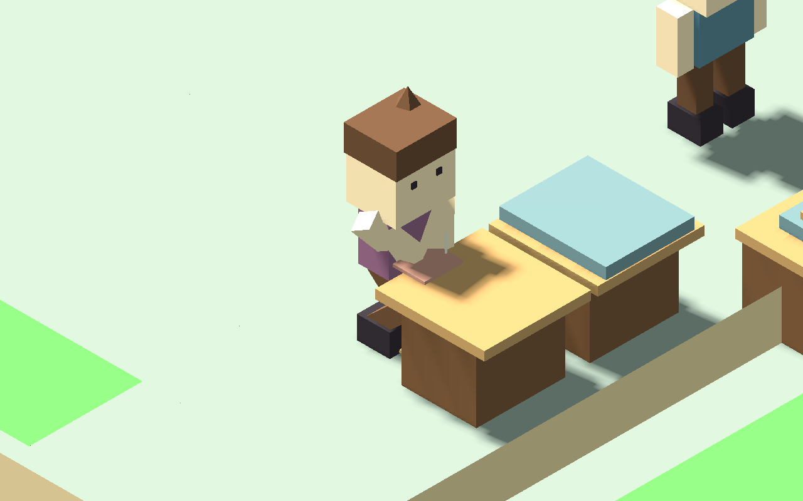
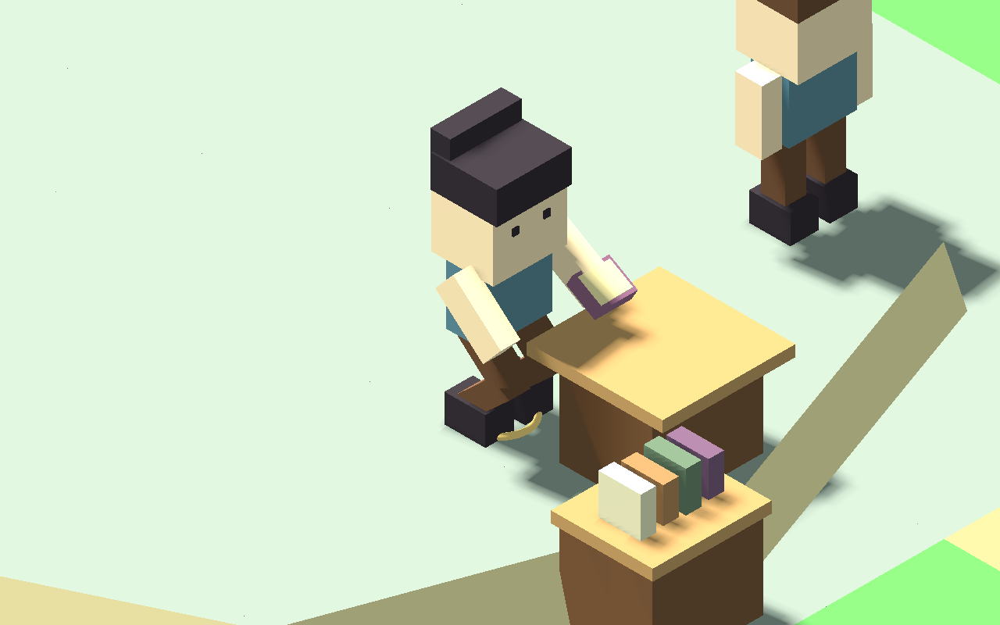

# 居民工作台與手持動作

五種室內職業（木工、鐵匠、廚師、裁縫、研究員）現在會先沿正常碰撞路線走到相應工作台，停步並通過到位檢查才顯示工作工具與動作。進門、行走、下班、赴約或接受服務期間不播放這些工作動作。居民腿部動畫先處理站穩，手部再接上工作表現。

木工與鐵匠共用第一張工房工作台，裁縫使用第二張。相同工作台同時只分配一位居民，其餘走到附近可通行、彼此分開的等候位置。以居民識別碼穩定排序選取當下合資格使用者；目前沒有額外輪候公平性計時器。玩家實際位置進入工作點 24 像素內時，居民收工具並步行讓位；玩家離開後再走回台前，不瞬移。這是空間協調，並未加入角色彼此阻擋的物理碰撞。

工作動作共用玩家已校準的敲擊、料理、裁縫與閱讀姿勢，移除鐵匠／研究員原來固定掛在身側的工具。暫停時居民工作相位停止，讀檔重建相位並保留原位置。港鎮缺少工房時不憑空補工作台。

本包不增設產出、材料、核准或金錢回呼。NPC 既有生產排程與玩家公共材料核准、每日值勤／備貨限制保持；工作動畫次數不代表新增成品批數。NPC 生產仍由原有模擬規則結算，尚未改成每次實際敲擊／輪候對應一批成品。沒有新增個人錢包。

## 驗證

- 21 組回歸共 51,387 個檢查：新工作台流程 5,021，另涵蓋居民／玩家步態、守衛班表、返家睡眠、玩家工作台與職業服務等。
- 兩鎮各 96 tick、46,080 移動幀的原始新局自然測試，共 14 個整合檢查：邊境鎮 9 位、港鎮 4 位居民實際到台操作；原始 20／15 位居民均觀察到步行及在家睡眠，中途讀檔成功。每個移動幀檢查碰撞，動作取樣 15 Hz，鞋底幾何每 tick 檢查；無異常位置、瞬移或穿地。此為各一日，並非長期全玩法通關。
- 舊四日壓縮進度的匯入、原座標、職涯紀錄、每日額度與暫存動畫重建檢查。
- 7 個原生受控情境、14 張畫面：控制職業、成人外觀與玩家室內位置；居民從門口按碰撞路線走到工作點。畫面不是自然整日遊玩的截圖。

報告：RESIDENT_WORKSTATION_TESTS.json、RESIDENT_WORKSTATION_REGRESSION.json、RESIDENT_WORKSTATION_NATURAL_FRONTIER.json、RESIDENT_WORKSTATION_NATURAL_HARBOR.json、RESIDENT_WORKSTATION_CAPTURE.json、RESIDENT_WORKSTATION_DELIVERY.json。

下一包處理農夫／礦工戶外工具握持、工作地點動作，以及移動／返家時收工具。完整搬運、物件交接與更細緻手指動作仍待後續。
