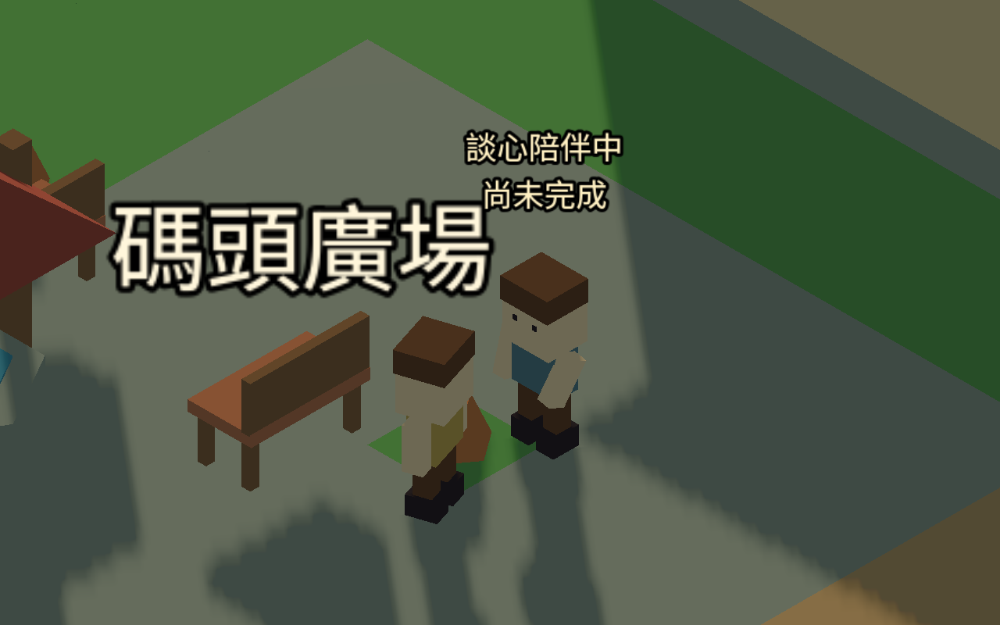
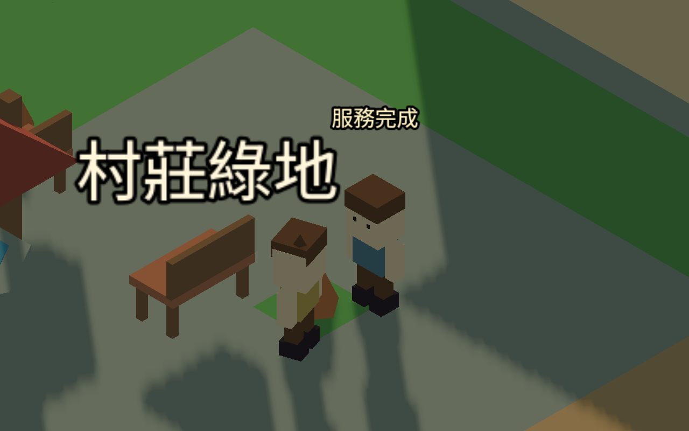
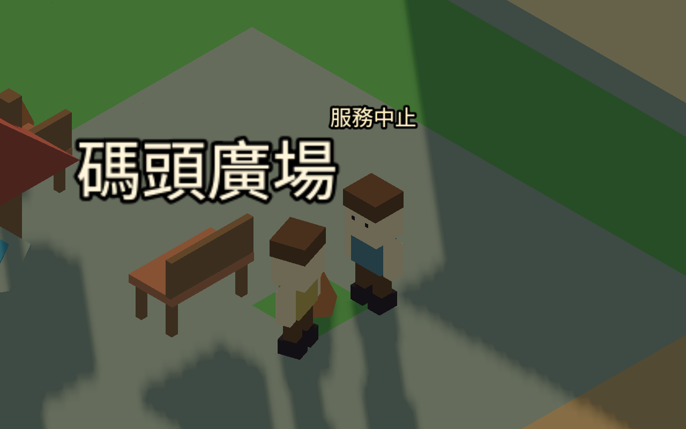

# 醫護與牧師現場動作（2026-09-12）

旅人真正開始醫護／牧師值勤後，面向服務對象；醫護抬臂、輕微前傾，牧師以較慢的單手手勢陪伴。動作起始約 0.45 秒漸入。頭上標明「尚未完成」，實際結算後才短暫顯示完成或中止。離開、需求消失或取消會立即收回手臂。

這是第一版程序動作，並非完整骨架、手腕接觸或醫療處置動畫。從現有模型分離兩臂，以肩膀為轉軸；保留原三角面、材質與其餘角色外觀。只有旅人啟用此手臂結構，不會把 NPC 的職業稱號當成正在服務。前傾沿整個角色旋轉，頭髮及帽子一起移動。

移動輸入優先，走動時收回服務手勢；不改座標、路徑、碰撞、居民睡眠、服務停留、時計、公共資源、每日次數或技能結算。暫停凍結手勢；讀檔只依當前有效服務重建姿勢，不重播過往完成提示。工作動畫不寫入存檔。

## 驗收

- 更新後 216 項：兩鎮、兩職業的真實開始／完成／取消／離開／需求失效／進行中重載，純顯示不改世界及位置，暫停、步行優先、提示期限。
- 四種原始身形（男女、老人、兒童）的兩臂各保留 12 個三角面，分離前後總面數相同。
- 8 組既有回歸 876 項，全數通過：近身值勤、服務介面、室內出入、睡眠照護、服務對話、停留與主動回憶。合計 1,092 項。
- 已透過開啟中的 Godot 編輯器執行獨立 `tests/service_visual_scene.tscn`，擷取並目視檢查兩鎮各醫護／牧師的進行中及完成／中止，共 8 張原生 1280×800 圖片。`SERVICE_VISUAL_CAPTURE.json` 記錄四次真實開始成功，需求與到場檢查皆通過。這些是受控場景，不是自然遊玩紀錄。
- 發現並修正服務提示被物件遮住、兩行提示與旅人標記重疊：服務提示使用與旅人標記相同的遮擋顯示策略，服務期間取代旅人標記；提示消失再恢復標記。驗收鏡頭移至空地，避免井棚遮住肢體。
- `SERVICE_PERFORMANCE_TESTS.json` 的 rendered_samples=false 只描述該次無畫面回歸；本次原生截圖由上述獨立場景產生。

本包不重跑多日自然模擬，不擴張至全部職業或完整走路動作。本包已完成桌面基本姿勢與提示目視檢查；後續接其他職業現場工具動作；官網視覺評估仍保留在後段排程。

## 實際渲染範例

模型仍是簡單低多邊形肩臂轉動，完整骨架、手腕接觸、NPC 回應姿勢、手機近距離視角與地名標籤密度仍有優化空間；不將這次基本目視檢查宣稱為完整動畫美術定稿。
