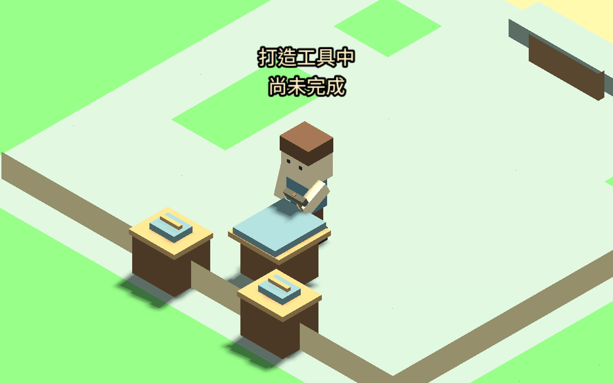

# 工房工作台值勤（2026-09-12）

木匠與鐵匠現在必須實際走到工房工作台前的金色圓形標記，再開始值勤。職業頁提供「查看工房工作台」鏡頭定位；按鈕不移動旅人。僅改邏輯地點或停在房間中央不能開工，離開定位點，即使仍在同一間房屋，也會中止。

## 動作與配置

開始、持續及結算共用實際位置檢查，容許定位中心兩像素內的誤差。位置由現有工房格子推導，工作台佔既有阻擋格、站位佔可行走格。工作台移到第一排可接近的牆邊，工作面放大但仍在阻擋格內。海風鎮缺工房時不產生工作台。

站定後旅人面向工作台，槌頭持續握在手中，依槌頭頂點求出接觸角度，再做抬槌／落槌循環。工作墊頂部高度 0.92，原生取樣槌頭最低高度約 0.91992（數值解算誤差）；落點位於工作台上方。動畫不移動腳、不改時間或獎勵。走動保留原移動朝向並收起工具。

原有材料核准、公共資源扣料、需求上限與每日三次額度不變。停在工作台的有效工作可讀檔續做，離開、進出門或取消不給獎勵。沒有實際位置觀測的純模擬介面保留既有行為；可玩介面有位置檢查。

## 驗證

- 新工作台測試 1,815 個斷言，涵蓋真實步行、遠端拒絕、鏡頭按鈕不瞬移、兩職業開始／完成／同房離開／取消／讀檔／門口中止，以及槌頭高度和落點逐幀檢查。
- 家具邊界、室內服務、各職業動作、設施、服務停留和職業 UI 回歸合計 8,237 個斷言通過；總計 10,052。大量斷言為幾何與動作取樣，不等同同數量的獨立玩法案例。
- 原生兩職業實際走到工作台、值勤、走開中止，276 移動幀，保存六張畫面；調整鏡頭與工作面後重新擷取，兩職業代表圖已目視核對。原環境建物未額外隱藏。
- 需求是受控測試，原本缺設施的城鎮仍缺設施；未重跑多日自然職涯驗收。既有測試的站位前置更新為實際工作台，另有獨立實際步行測試。

[工作台測試](WORKSTATION_TESTS.json) · [整組回歸](WORKSTATION_REGRESSION.json) · [原生紀錄](WORKSTATION_CAPTURE.json)

## 下一工作包

接續廚師、裁縫及研究員各自的操作台與近身手勢，沿用本包真實站位、離開取消及讀檔規則。這三種職業目前仍使用既有手持物動作。NPC 工作站排班、完整骨架、步態及音效尚未完成；官網整體風格評估保留後續排程。
