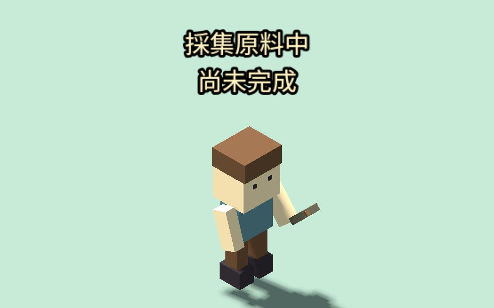
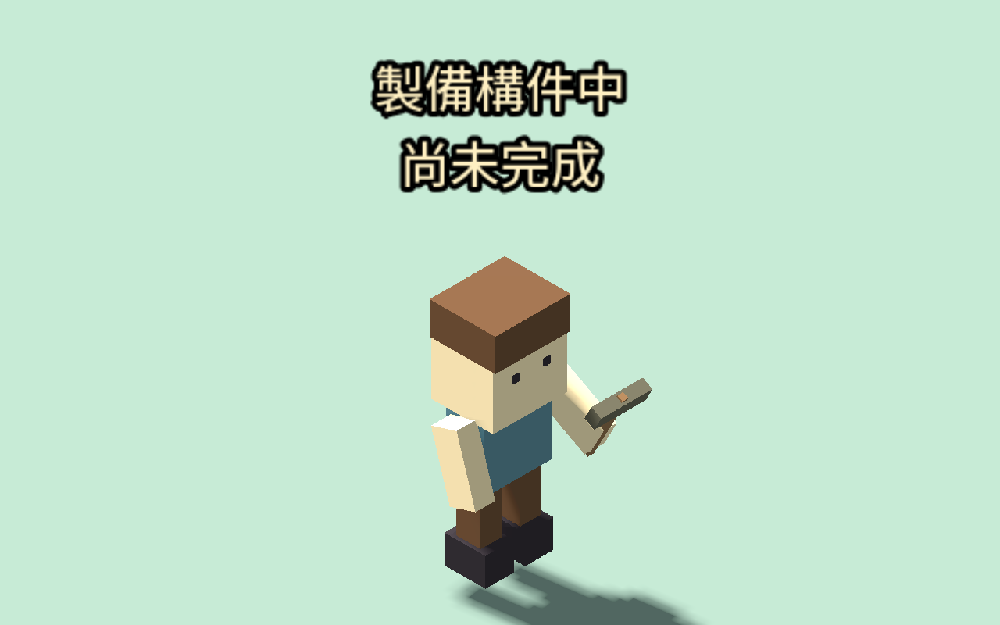
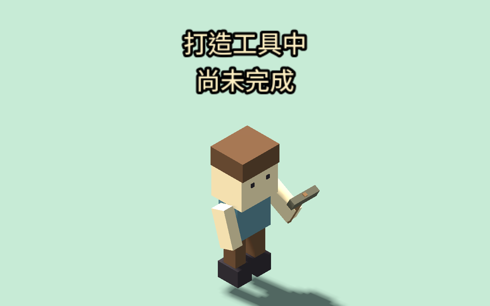
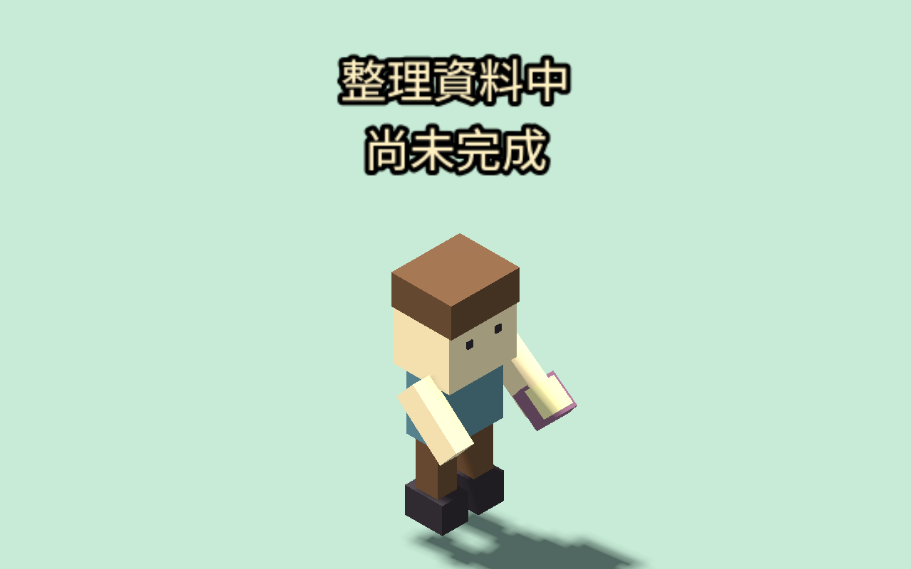

# 四職業持具動作（2026-09-12）

礦工持鎬，木匠／鐵匠持槌，研究員持書。只有已開始且在值勤地點的旅人才出現工具與手勢，並顯示尚未完成；移動時收起，暫停凍結，結束後顯示實際完成或中止並恢復旅人標記。讀檔依 active 工作重建，不重播舊結果。玩家不再因存檔中的職業稱號常駐手持工具；NPC 原有職業配件保留。

工具綁定肩臂，握點調整至手掌，鎬柄與槌柄向前延伸。這是程序式持具動作第一版，不包含工作台／礦石接觸、肘腕骨架、敲擊聲、粒子效果或完整職涯劇情。木匠與鐵匠目前共用槌動作。

顯示層只讀既有值勤、位置與完成次數，不推進時計、不搬動人物、不增加物資／技能。既有系統仍負責材料核准、需求／備貨、取消與獎勵。完成提示依觀察到的值勤結束與完成計數，讀檔清空顯示暫存。沒有工房的港口鎮不新增木匠／鐵匠任務或設施。

## 驗收

- 376 項新增檢查：兩鎮四職業、缺少工房、實際核准／開始／完成、取消、離開、需求滿足、進行中重載、步行優先、暫停、純顯示不改世界與位置、握點方向。
- 7 組回歸共 871 項：原醫护／牧師動作、製作邏輯及介面、擴充職業及介面、缺少設施、服務停留。合計 1,247 項通過。
- 使用 Godot 編輯器執行 `tests/work_visual_scene.tscn`，四種姿勢皆已擷取並目視檢查；`WORK_VISUAL_CAPTURE.json` 記錄實際開始狀態。為看清握點，場景暫時隱藏建物並加中性地板，未移動已到場的旅人。圖片是受控模型檢查，不代表室內遮擋已解決，也不是自然遊玩紀錄。
- 測試用需求、公共材料與角色位置皆為受控 fixture；未跑新的多日自然模擬。既有產量上限及每日額度沒有修改。

接續：農務澆水、廚師、裁縫、守衛與商人的值勤動作；工作台接觸、室內可視性、全身步態與音效另列完善，不將六職業動作視作全部動畫完成。
